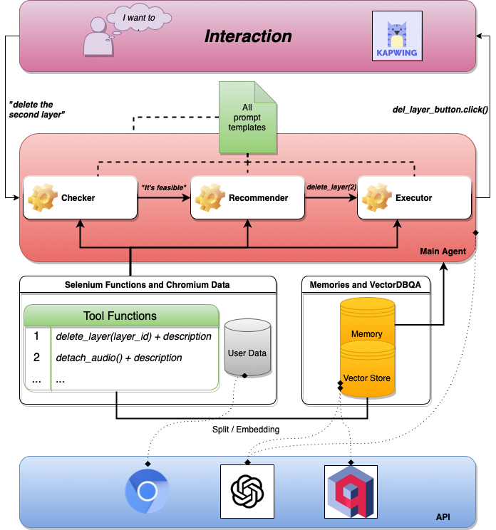

##### 📌 NOTE: This is my work repository forked from `Alchemic`. I interned there for three months. In the experimental folder is the main work on the second half of the internship, mainly on the email management site Instantly.

# permian-ai: AI_Agents for Kapwing Online Video Editing

## 1️⃣ What is permian-ai
*permian-ai* 🦎 is a tool that assists users in video editing, it is an automatic editing agent that allows interaction through natural language. *permian-ai* allows you to describe in text what you want to achieve and then the agent executes it in a Kapwing web page. *permian-ai* implements this process by building an AI Agent.

## 2️⃣ How permian-ai works 
There are several kinds of agents in *permian-ai*, and these agents have different functions. Some agents are responsible for understanding user queries and decomposing them into steps; some agents are responsible for selenium code generation based on steps to automate web page manipulation; all agents have access to vectorstores, which are vectors of definitions and corresponding scripts about video clip tasks.

>Vectorstore is a chunking of textual knowledge embedded in high-dimensional vectors (the vectorstore is a knowledge base that uses similarity matching to query relevant knowledge. 💽

Faster agents only need GPT-Index vectorstore and selenium code matching, while smarter agents can generate natural language instructions and the corresponding script code. We also work on making the AI Agent learn from the html web environment to achieve real code generation without the need to give code samples manually. 🚀 But this is extremely challenging.

Our design of *permian-ai* works well on video editing tasks. The results show that with good enough prompt designing and prior knowledge, the AI Agent can be competent on multi-step complex tasks. More, *permian-ai* has good generalizability and the architecture we designed can be used for other tasks. In the future, we also hope to use it for any professional websites, such as office websites or shopping websites, etc.



This is a flowchart of the framework for the collaboration of three sub-agents 🔩. This structure is implemented in `MemoryGPTScriptAgent`. The Kapwing website is launched by the chromium engine and controlled by the agent-generated selenium script code. 

In a single interaction, the user's input passes through the checker, recommender and executor sub-agents and outputs the control action, i.e. the automation script code. At the bottom are the tool functions, memory pool and vector store that the agent needs to use, and we show the api services that need to be used. You can choose gpt-4 and other LLM such as Anthropic and more. 

## 3️⃣ Requirements

First install all dependencies. We use langchain 🦜🔗, llama-index 🦙 and other good stuff.
```
cd permian-ai
pip install -r requirements.txt
```
Then, fill in the config file with your api_keys and chromedriver userdata path in ```config/config.yaml ```. You need to change the `KAPWING_URL`, `KAPWING_PROJECT_NAME` to your own, and change the qdrant and pinecone api if needed(optional).
```
OPENAI_API_KEY: # change to your api key
QDRANT_HOST: https://...
QDRANT_API_KEY: # change to your api key
PINECONE_API_KEY: # change to your api key
PINECONE_HOST: us-east-1-aws

KAPWING_URL: https://www.kapwing.com/folder/... # your kapwing personal page url
KAPWING_PROJECT_NAME: # your kapwing project name
USER_DATA_DIR: /Users/.../user_data # your chromedriver path which logged in kapwing
```
You need to sign up for Kapwing, and also make sure you have chromedriver.

## 4️⃣ Different Agents
You can find all agents in `agents/selenium_agent.py`, they are
- `FastAgent` first use vectorstore for semantic search and recommend three relevant options, then execute the chosen one directly without using LLM.
- `RecommendAgent` recommends three relevant options for user to pick, according to user objective. Also vectorstore only.
- `ExecuteAgent` execute the selenium code.
- `GPTScriptAgent` is the implementation of above framework, but without memory pool.
- `MemoryGPTScriptAgent` is the implementation with memory 🧠.

The essential difference between these agents is actually the corresponding vectorstore data and the different parts of the prompt design. `FastAgent` is highly recommended, it has a time delay of five seconds or less. `GPTScriptAgent` and `MemoryGPTScriptAgent` are based on langchain tools, so they have better effect of inference chain and better visualization.

## 5️⃣ All Prompts
You can find all prompts in `config/prompts.yaml`, check and change and play with them.
We didn't use Guardrail and design the format normalization ourselves. It can be improved. When you select the agent, the prompt applied to it will be used. 🖋
- `FastAgent` uses prompts `fast_func_prompt` only.
- `SimpleScriptAgent` uses prompts `simple_script_main_agent_template_prompt`, `simple_script_executor_description`, `simple_scripts_prompt`, `executor_prompt` and `mask_prompt`.
- `MemoryGPTScriptAgent` uses even more prompts, you can check `prompts.yaml`.

## 6️⃣ Data and Demonstrations
You can check all the demonstration data in `data/` file, they are
- `frameIo_dataset.csv` is the dataset from frame.io video editing website.
- `functions.txt` has all the selenium function names, variables and demonstrations.
- `instructions_scripts.txt` has all the data {USER_QUERY, INSTRUCTIONS, SCRIPTS}, and masks are designed for placeholder.
- `tools_document.txt` is the text version of `utils/tools.py`.

The dataset for evaluation is `data/selenium_datasets.xlsx` 📚, you can use those given Queries for play. See how to play with *permian-ai* below.

Also, the evaluation results are stored in `logs/` file. 
```
2023-04-26 15:17:37,846 - AgentLogger - INFO - The mean accuracy is 0.92.
2023-04-26 19:19:49,634 - AgentLogger - INFO - The mean latency is 4.89.
2023-04-26 15:17:37,846 - AgentLogger - INFO - The mean top3 accuracy is 0.94.
```

## 7️⃣ Selenium Functions
We now have several selenium functions such as `add_text`, `change_text_color`, `add_sound_effect`, etc. We still need to build more, or let the agent learn from them.
We now define selenium function with selenium-IDE. You can see all the selenium functions in `utils/tools.py`.

## 8️⃣ Vectorstores
All of them are in utils/vecs.py. We now integrate
- `gpt_index_query`: use llama-index.
- `qdrant_query`: use Qdrant.
- `pcone_query`: use Pinecone.
- `faiss_query`: use faiss.

All of them take demonstrations from `data/` to build embedding vectors.

## 9️⃣ How to Play and Evaluate
If you want to play with *permian-ai* agents with your own input video editing objective, run this with `FastAgent`
```
python agents/selenium_agent.py
```
You can change to other agents in main function.

For evaluation with the datasets, you can run this
```
python tests/unit_tests.py --model_name gpt4 --temperature 0 --memory False --fast True --vectorstore_type gpt-index --use_chromedriver True
```
Change the arguments for your pleasure.

